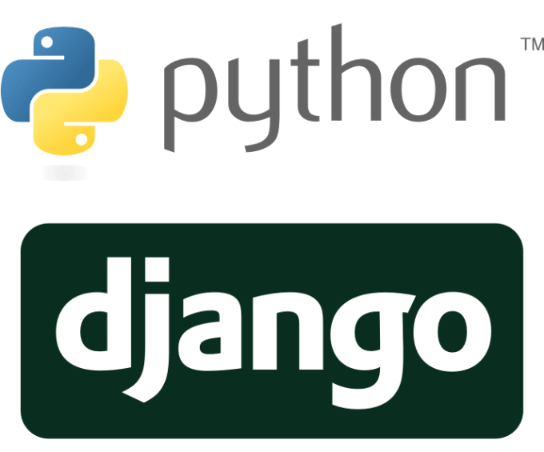

# ¡Hola! 👋🏻 Mi nombre es: Jonner Serrano, soy desarrollador back-end y Product Owner. 👨‍💻

Mi nombre es Jonner Serrano, soy desarrollador back-end en Python con Django y Flask, MySQL

# Skills:

# 🌍 Por si deseas contactarme 👨‍💻 :

)

